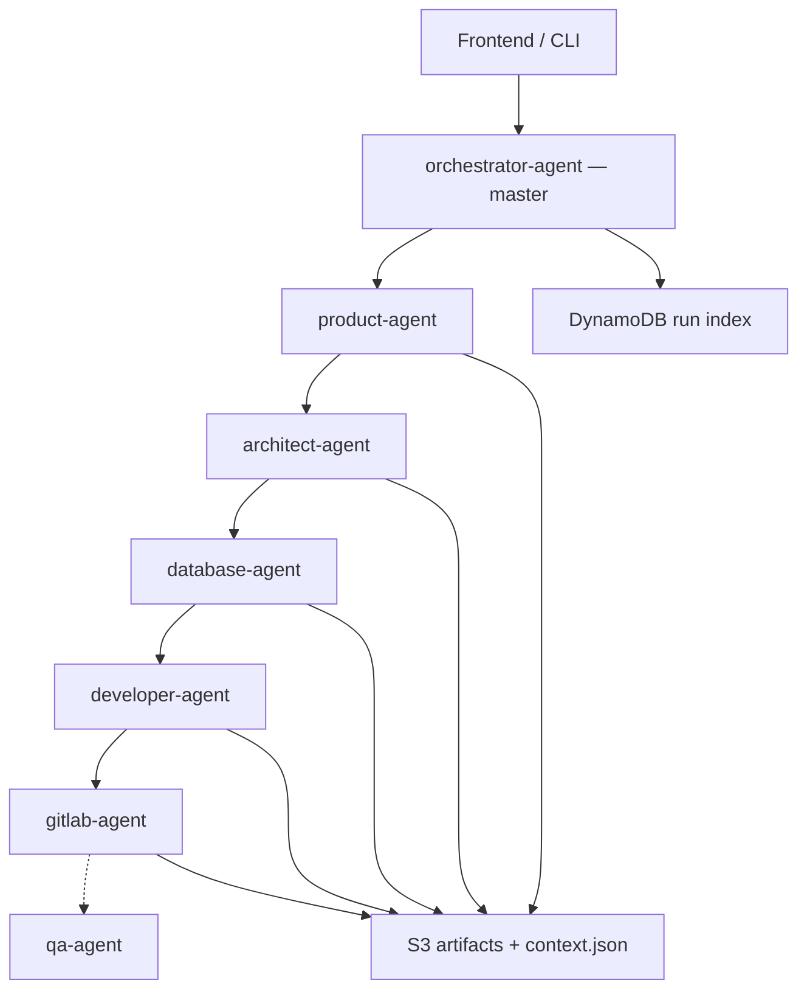

# Orchestrator Agent

## Architecture



## What this agent does

**Master coordinator** — single entry point for end-to-end delivery:

1. **Deterministic mode** — `run_sdlc_pipeline` tool / `--run-pipeline` CLI
2. **Delegation mode** — LLM uses A2A tools for ad-hoc work

| Role | Who |
|------|-----|
| Sequence specialists | orchestrator |
| Write PRD/design/SQL/app/GitLab artifacts | product, architect, database, developer, gitlab agents -> **S3** |
| Run index (`runId`, status, `lastAgent`) | orchestrator -> **DynamoDB** |
| Optional extended QA | qa-agent **after** gitlab |

## Pipeline order (canonical)

`product -> architect -> database -> developer -> gitlab -> [qa]`

Internal gate (not a diagram node): local pytest verify runs after developer, before gitlab.

Optional side branch: web-crawler (not in default chain).

## Run full pipeline (local)

```powershell
python agents/orchestrator-agent/orchestrator_agent.py `
  --run-pipeline `
  --target-app inventory-app `
  --input-file inputs/inventory-app.txt
```

With QA after GitLab:

```powershell
python agents/orchestrator-agent/orchestrator_agent.py `
  --run-pipeline --with-qa `
  --target-app inventory-app `
  --input-file inputs/inventory-app.txt
```

## AgentCore cloud

- Deploy **orchestrator-agent last** (after specialist runtimes).
- `AGENTCORE_A2A_PEER_URLS=product-agent=https://...,architect-agent=https://...,...`
- `ARTIFACT_STORE=s3`, `ARTIFACT_S3_BUCKET` — specialists + context -> S3; orchestrator -> DynamoDB.

## A2A tools

- `run_sdlc_pipeline` — deterministic full chain
- `a2a_send_message` / `a2a_list_discovered_agents` — ad-hoc delegation

## Serve A2A

```bash
python agents/orchestrator-agent/orchestrator_agent.py --serve-a2a --port 9100
```
