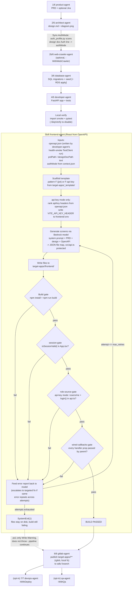

# Frontend Agent: How It Works and How It Connects to the Pipeline

Branch checked at write time: `Aryan_sdlc_agentic_ai` (not `MVP_SDLC_agentic`).

All claims below are grounded in the files actually read (listed at the end). Where the code
does something different from what a section title implies, that mismatch is called out
explicitly rather than smoothed over.

## 1. What the frontend agent is and where it sits in the pipeline

The frontend agent lives at `backend/agents/frontend-agent/frontend_agent.py` (NOT
`backend/agents/pipeline/frontend_agent.py` — that path does not exist; `agents/pipeline/`
only holds per-run JSON handoff/context files, not agent source). It generates a React +
TypeScript frontend for a target app under `target-apps/<app>/frontend/`, driven by the
backend's own OpenAPI contract.

Exact run order, taken from `backend/scripts/run-sdlc-local.ps1` step labels/comments
(lines 463–631):

```
1/6 product-agent      (PRD [+ optional Jira])
2/6 architect-agent    (diagram + design.md)
2b/6 web-crawler-agent (optional, -WithWebCrawler)
3/6 database-agent     (SQL migrations + seed [+ RDS apply])
4/6 developer-agent    (FastAPI [+ Streamlit/React per deliveryProfile])
    Local verify        (import smoke + pytest, -SkipVerify to disable)
5b/6 frontend-agent    (React from OpenAPI contract)  <-- this agent
6/6 gitlab-agent       (MCP publish to sdlc/<app> branch)
```

`-WithDeploy` adds an opt-in `7/7 devops-agent` step after GitLab publish; `-WithQa` adds an
opt-in `qa-agent` step after that. Both are outside the `/6` numbering and irrelevant to the
frontend agent.

The frontend-agent step is labeled `5b/6`, not `5/6` — it is a "half step" wedged between
developer-agent's local verify and gitlab-agent, and the script's own comment
(`run-sdlc-local.ps1:594-595`) says it "runs by default; `-SkipFrontend` to disable" and
"Mirrors `sdlc_pipeline` `_step_frontend` (local transport)". The comment at
`run-sdlc-local.ps1:149-151` adds an important caveat verbatim:

> Frontend-agent runs by default after developer, before GitLab (matches sdlc_pipeline
> `_step_frontend`). `-SkipFrontend` to disable. **Not wired into the orchestrator; this is
> the local pipeline's own step.**

So `run-sdlc-local.ps1` runs frontend-agent unconditionally (default ON) unless
`-SkipFrontend` or `-SkipDeveloper` is passed (`$runFrontend = (-not $SkipFrontend) -and
(-not $SkipDeveloper)`, line 151). Whether the *cloud/AgentCore* orchestrator path
(`_shared/sdlc_pipeline.py`'s `_step_frontend`) invokes it the same way was not verified here
— out of scope for this doc, which is grounded only in the files listed at the end.

## 2. How it is invoked

`run-sdlc-local.ps1:596-608`:

```powershell
$frontendArgs = @(
    "agents/frontend-agent/frontend_agent.py",
    "--target-app", $Feature,
    "--context-file", $ContextFile,
    "--full-regen"
)
if ((Invoke-PipelinePython -ArgumentList $frontendArgs) -ne 0) {
    Write-Warning "frontend-agent reported issues - review target-apps/$Feature/frontend before GitLab publish."
}
```

Argument meaning (from `frontend_agent.py:997-1022`, `main()`):

| Flag | Meaning |
|---|---|
| `--target-app` | The feature slug (`$Feature`), resolved via `resolve_target_app()` — determines `target-apps/<slug>/` |
| `--context-file` | Path to `agents/pipeline/<feature>.context.json`; parsed and merged into the run context via `resolve_cli_context()` |
| `--full-regen` | A generation-mode flag, **not a network/mode flag**. It tells `run_task()` to call `_clear_frontend_generated()` first, wiping `src/components/` and `src/types.ts` before generation (see §4). The `main()` docstring for this flag is explicit that it is "Set only by the orchestrator... Standalone CLI use should never pass this." — yet `run-sdlc-local.ps1` (a local/manual entry point) *always* passes it. This is a real inconsistency between the flag's own documented intent and how the local script uses it, not an assumption on my part. |

A non-zero exit only produces a `Write-Warning` — it does **not** `throw`, unlike every
other pipeline step (product/architect/database/developer all `throw` on failure). So a
failed frontend build does not stop the pipeline; gitlab-agent still runs next and will
publish whatever files are on disk, including a build that never passed (see §5, §7).

## 3. Inputs it reads

All three are read in `run_task()` (`frontend_agent.py:849-923`):

| Input | Symbol/file where read | Notes |
|---|---|---|
| OpenAPI contract | `app_dir / "openapi.json"`, read via `_read()` at `frontend_agent.py:883` | Raises `SystemExit` if missing (`frontend_agent.py:885-889`) — "Run the backend/developer step first so the spec exists." |
| Pipeline context | `merge_run_handoff_context(context, include_db_paths=False)` at `frontend_agent.py:853`, then `ctx.get("prdPath")` / `ctx.get("designDocPath")` at lines 877-878 | Context comes from `--context-file` merged with any S3-stored run context via `_shared/pipeline_context.merge_run_handoff_context` |
| authMode | `ctx.get("authMode")`, defaulted to `"jwt"` at `frontend_agent.py:854` | Written earlier in the pipeline by `Sync-AuthMode` (`run-sdlc-local.ps1:524`), which calls `agents/_shared/auth_profile.py --sync`. `auth_profile.derive_auth_mode()` scans the **design doc's** Auth line(s) only (never the PRD, never an LLM judgment — see `auth_profile.py:66-84`) and writes `authMode` into `<feature>.context.json`. |

Where OpenAPI contract comes from: `developer-agent`, not frontend-agent or architect-agent.
Specifically `backend/agents/developer-agent/developer_agent.py`'s health-smoke script
(`_HEALTH_SMOKE_SCRIPT`, lines 3354-3409) runs inside developer-agent's own build-validation
loop (`run_service_validation`), spins up the generated FastAPI app in a `TestClient`, calls
`GET /openapi.json`, and writes it verbatim to `openapi.json` in the app's own working
directory (`target-apps/<app>/openapi.json`) — confirmed at
`developer_agent.py:3403-3409`:

```python
openapi = client.get("/openapi.json")
if openapi.status_code == 200:
    spec = openapi.json()
    with open("openapi.json", "w", encoding="utf-8") as f:
        json.dump(spec, f, indent=2)
    print("OPENAPI_SAVED path=openapi.json")
```

This means frontend-agent's OpenAPI input is the **live, introspected** spec of the app that
was actually generated and started successfully — not a spec written by architect-agent's
design doc, and not a spec regenerated by frontend-agent itself.

## 4. How it generates React

`run_task()` does, in order (`frontend_agent.py:849-923`):

1. **Scaffold** — loads `agents/developer-agent/scaffold.py` by file path (its folder name
   has a hyphen, so it can't be imported normally — `frontend_agent.py:52-57`), then calls
   `scaffold.scaffold_service(template_dir=_TEMPLATE_DIR, service_dir=app_dir, pattern=...)`.
   Pattern is `"F-api-key"` when `authMode == "api-key"`, else `"F"` (jwt, default) —
   `frontend_agent.py:864-871`. The template source is `backend/target-apps/_template/`.
   Pattern `"F"` copies the JWT `src/api.ts`; pattern `"F-api-key"` copies
   `src/api_apikey.ts` in its place (confirmed by the two template files read: `api.ts` and
   `api_apikey.ts` have identical exported function names — `apiGet`/`apiPost`/etc.,
   `getCurrentUser`, `hasRole`, `isCurrentUser`, `isSessionValid` — so generated screens
   never need to know which variant is underneath).
2. **api-key header resolution** (api-key mode only, `frontend_agent.py:894-914`) — after
   scaffold (deliberately, since scaffold force-overwrites `frontend/.env`), it ranks every
   `apiKey`-type header the backend's own `openapi.json` `securitySchemes` declares
   (`_rank_api_key_header_names`, `frontend_agent.py:249-338`) and writes
   `VITE_API_KEY_HEADER` (and `VITE_ADMIN_API_KEY_HEADER` for a two-tier app) into
   `frontend/.env`. This is deterministic, never an LLM guess — comment at line 251 says so
   explicitly.
3. **Prompt build** — `user_message` bundles the PRD text, design doc text, and the full
   OpenAPI JSON, ending with "Generate the React screens now. Return only the JSON file
   map." (`frontend_agent.py:918-923`).
4. **Model call + write** — `Agent(model=_model(), system_prompt=_build_frontend_system_prompt(ctx))`
   (`frontend_agent.py:934`), where the system prompt is `_SYS_PROMPT_TEMPLATE` with
   `{{AUTH_SCREEN_SECTION}}` swapped for either `_JWT_AUTH_SCREEN_SECTION` or
   `_API_KEY_AUTH_SCREEN_SECTION` depending on `authMode`. The model must return a single
   JSON object mapping relative file paths to file contents
   (`frontend_agent.py:215-218`); `_generate_and_write()` parses that JSON (stripping
   markdown fences if present) and writes each file under `frontend_dir`, **except**
   `src/api.ts`, which is in a hardcoded `PROTECTED` set (`frontend_agent.py:799`) and is
   always skipped even if the model tries to rewrite it.
5. Model: `os.getenv("MODEL_ID", "us.anthropic.claude-sonnet-4-20250514-v1:0")` via Bedrock,
   `max_tokens=32000`, `cache_config=CacheConfig(strategy="auto")` (`frontend_agent.py:225-240`).

`--full-regen` (always passed by `run-sdlc-local.ps1`) triggers
`_clear_frontend_generated()` before step 1, which deletes `src/components/` and
`src/types.ts` — the parts of `frontend/src/` the scaffold does NOT force-refresh every run
(`frontend_agent.py:816-846`), so a stale component/type from a previous run can't survive
as an orphan into a fresh generation.

## 5. The build + gate + retry loop (core of this doc)

The retry loop lives in `run_task()`, lines 932-994. Up to
`FRONTEND_AGENT_VALIDATE_RETRIES` (env var, default `2`) retries — i.e. up to 3 total
attempts. On each attempt: generate + write files, run the **build gate**, then (only if the
build passed) run three **deterministic gates** in a fixed order. Any failure — build or gate
— feeds the failure report back to the model as the next `current_message` and loops.

### Build gate — `_run_frontend_build(frontend_dir)` → `tuple[bool, str]`
(`frontend_agent.py:390-439`)

Runs `npm install` (only if `node_modules` is missing) then `npm run build` in
`frontend_dir`, each with a 300s timeout. **Degrades gracefully**: if `npm` is not on PATH,
returns `(True, ...)` immediately — build validation is silently skipped, not failed, in an
environment without Node. Otherwise FAILS when `npm install` or `npm run build` returns a
non-zero exit code (tsc errors, since the project uses strict TypeScript per the system
prompt's build rules).

### Gate 1 — `_validate_session_gate(frontend_dir, auth_mode)` → `tuple[bool, str]`
(`frontend_agent.py:442-479`)

```python
def _validate_session_gate(frontend_dir: Path, auth_mode: str = "jwt") -> tuple[bool, str]:
```

**FAILS when:** `src/App.tsx` does not exist, or its text does not contain the literal
substring `isSessionValid(`. In plain English: the prompt *tells* the model to gate the
mount-time login-vs-authenticated-shell decision on calling `isSessionValid()` from
`api.ts`, but the docstring notes this has drifted before (two named real apps —
desk-booking, it-asset-lifecycle — called `getCurrentUser()` and set `isAuthenticated(true)`
regardless of the result). A passing `tsc` build cannot catch this because both the correct
and buggy pattern type-check fine. This gate is a textual grep, not a semantic check — it
only confirms the string is present somewhere in the file, not that it's actually used to
gate the mount decision correctly.

### Gate 2 — `_validate_role_source_gate(frontend_dir, auth_mode)` → `tuple[bool, str]`
(`frontend_agent.py:481-507`)

```python
def _validate_role_source_gate(frontend_dir: Path, auth_mode: str = "jwt") -> tuple[bool, str]:
```

**FAILS when:** `auth_mode == "api-key"` AND (`src/api.ts` doesn't exist OR its text is
missing either `/api/v1/users/me` or the literal substring `export async function login`).
Always PASSES for `jwt` mode (line 494) — this gate is api-key-only. In plain English:
api-key apps must resolve each caller's *real* role from the backend (via `login()` fetching
`GET /api/v1/users/me`), never let the user pick their own role — without this, every
`hasRole(...)` check would silently evaluate `false` for everyone and admin-only screens
would never render, a bug invisible to `tsc`.

**Contradiction worth flagging:** `PROTECTED = {"src/api.ts"}` in `_generate_and_write()`
means the model is never allowed to write `src/api.ts` — it's copied by scaffold, force-
refreshed every run. But this gate greps `src/api.ts`'s *content* as if it might vary,
implying it's meant as a genuine backstop against api.ts drift. In practice, since the file
is a static template copy (`api_apikey.ts` → `src/api.ts`) whose content is fixed by pattern
`F-api-key` and never model-written, this gate can only fail if the template file itself
regresses — not something a given pipeline run's LLM generation step can cause. The
docstring's framing ("api-key apps must have an async login()...") reads as if guarding
against LLM output, but the actual code path it guards is a scaffold/template invariant.

### Gate 3 — `_validate_wired_callbacks_gate(frontend_dir, auth_mode)` → `tuple[bool, str]`
(`frontend_agent.py:634-719`)

```python
def _validate_wired_callbacks_gate(frontend_dir: Path, auth_mode: str = "jwt") -> tuple[bool, str]:
```

**FAILS when:** any `.tsx` component under `src/` binds a JSX event handler
(`onClick`/`onSubmit`/`onChange`) directly to a **declared, non-optional-looking** prop name
(via destructuring), that component is rendered elsewhere in the codebase, and at least one
render site does **not** pass that prop. In plain English: this catches "dead buttons" — a
child component wires `onClick={onCreateItem}` but the parent renders `<ItemList />` with no
props at all, so the button silently does nothing at runtime. `tsc` cannot catch this because
an optional handler prop type-checks whether or not it's passed, and `onClick={undefined}` is
a no-op, not a compile error. The docstring calls this "conservative by design": ambiguous
files (zero or multiple exported components) and components never rendered elsewhere (e.g.
the app root) are skipped rather than guessed at, to avoid false positives blocking a good
build. `auth_mode` is accepted for signature parity with the other two gates but does not
change this gate's logic (comment at line 652-654 says so explicitly).

### Retry behavior

Gates run **build → session-gate → role-source-gate → wired-callbacks-gate**, in that fixed
order (`frontend_agent.py:944-961`); the loop reports and retries on the *first* one that
fails, not all of them at once. If the same `(file, line, tsc-error-code)` triple survives
unfixed from one attempt to the next, `_escalated_retry_message()` (lines 736-771) switches
from the generic "fix all errors" retry prompt to a targeted one that quotes the exact
current lines at each repeated location and demands a minimal fix there instead of a full
file regeneration — because feeding the same generic instruction twice already failed once.
After `max_retries` is exhausted, `run_task()` raises `SystemExit(1)` — the process exits
non-zero, but as noted in §2, `run-sdlc-local.ps1` only warns on that, it doesn't stop the
pipeline.

## 6. How the generated `api.ts` talks to the backend

Two template variants exist under `target-apps/_template/frontend/src/`: `api.ts` (JWT) and
`api_apikey.ts` (api-key). Frontend-agent copies whichever one the scaffold pattern selects
into the generated app's `src/api.ts`; generated screens import from `src/api.ts` in both
cases, so screen code never branches on auth mode itself.

**Shared in both variants:**
- Base URL: `import.meta.env.VITE_API_URL ?? "http://localhost:8000"` (`api.ts:1-3`,
  `api_apikey.ts:1-3`) — same default, override via `VITE_API_URL` at build/run time.
- `TOKEN_KEY = "token"` — the localStorage key both variants use, despite the api-key
  variant's comment calling it a "pasted credential" rather than a JWT.
- `apiGet`/`apiPost`/`apiPut`/`apiPatch`/`apiDelete` all call `fetch` with headers built by
  a local `authHeaders()` helper, and route the response through a shared `handle<T>()` that
  throws on non-2xx and returns `undefined` on 204/empty body.
- `getCurrentUser()`, `hasRole(...)`, `isCurrentUser(id)`, `isSessionValid()` — identical
  exported signatures in both variants, so `App.tsx`'s mount-gate pattern (required by
  gate 1 in §5) is auth-mode-agnostic.

**JWT variant (`api.ts`) specifics:**
- `authHeaders()` reads the JWT from `localStorage`, sends `Authorization: Bearer <token>`
  (`api.ts:8-11`).
- `getCurrentUser()` **decodes the JWT payload client-side** (base64url-decodes the middle
  segment, parses `sub`/`role`/`roles` claims) — no network call. It also checks the token's
  own `exp` claim against `Date.now()` and returns `null` if expired (`api.ts:73-95`), which
  is what makes `isSessionValid()` meaningful without a round trip.
- No `/users/me` fetch anywhere in this variant — identity/role is entirely local, decoded
  from the token issued at login (login itself is implemented in generated screens per the
  system prompt, not in this file).

**api-key variant (`api_apikey.ts`) specifics:**
- `authHeaders()` sends the credential under `EMPLOYEE_HEADER` or `ADMIN_HEADER` (from
  `VITE_API_KEY_HEADER`/`VITE_ADMIN_API_KEY_HEADER`, written by frontend-agent per §4 step 2),
  never `Authorization` (`api_apikey.ts:23-24`, `62-67`).
- `login(key)` is exported from this file itself (unlike JWT mode, where there's no `login()`
  helper at all) and is the one place that makes a network call as part of "authentication":
  it stores the pasted key, then does `GET /api/v1/users/me` with the key attached under
  `EMPLOYEE_HEADER`, and caches the returned `{ id, role }` into `localStorage` under
  `userId`/`userRole` (`api_apikey.ts:41-53`). Throws (after clearing the credential) if that
  fetch fails.
- `getCurrentUser()` reads the **cached** `userId`/`userRole` from localStorage — it does not
  refetch `/users/me` on every call, only once, inside `login()`.
- `isSessionValid()` has no expiry concept: presence of a stored credential is the whole
  session (`api_apikey.ts:149-153`).
- On any `401` from any api call, `handle()` calls `clearCredential()` proactively
  (`api_apikey.ts:70-77`), which the JWT variant does not do (JWT expiry is checked locally
  at decode time instead).

So the JWT vs api-key difference is not just "which header" — it's a structural difference
in where identity comes from: **client-decoded token claims** (JWT) vs. **one backend round
trip cached client-side** (api-key), which is exactly what Gate 2 in §5 exists to enforce for
the api-key case.

## 7. How its output feeds publish (gitlab-agent) — local runs use the local filesystem, not S3

Frontend-agent itself never touches the `artifact_store` S3 path for writing its own output.
`run_task()` writes every generated file via plain `Path.write_text()` under
`target-apps/<slug>/frontend/` (`frontend_agent.py:806-809`), unconditionally — there is no
`ARTIFACT_STORE` branch anywhere in `frontend_agent.py`'s write path. (It does import
`_shared.artifact_store`, but only transitively, through
`merge_run_handoff_context()` → `get_context()`/`resolve_run_id()`, for *reading* run
context — never for writing frontend files.)

`run-sdlc-local.ps1` additionally forces `$env:ARTIFACT_STORE = "local"` unconditionally at
the top of the script (line 94), overriding whatever `.env`/`.env.local` may have set,
specifically because — per the script's own comment (lines 88-93) — the local orchestrator
must resolve paths against the local filesystem convention, never the S3/cloud-run
convention, even though `.env` may default to `ARTIFACT_STORE=s3` for AgentCore or the
control-plane frontend's S3 reads.

Publish itself is handled by `gitlab-agent` (step 6/6), which for the default "monorepo"
layout calls `collect_feature_artifact_paths()` →
`_collect_local_monorepo_artifact_paths()` (`_shared/gitlab_mcp_actions.py:370-396`). That
function does `(root / "target-apps" / slug).rglob("*")` and includes every file for which
`should_include_file()` is true — i.e. everything **except** `.venv`, `__pycache__`,
`.pytest_cache`, `node_modules`, `.git` (dir names) and `.env`, `.coverage` (file names)
(`gitlab_mcp_actions.py:192-211`). Since `frontend/` is a subdirectory of
`target-apps/<slug>/`, it is picked up automatically by this glob — there is no
frontend-specific logic in `gitlab_agent.py` at all (confirmed: grepping `gitlab_agent.py`
for "frontend" returns no matches). This means:

- **Confirmed from code, not assumed:** normal local pipeline runs use the local filesystem
  end-to-end for the frontend agent's output and its publish to GitLab. S3 (`ARTIFACT_STORE=s3`)
  only applies to the AgentCore/cloud transport, which this doc did not trace.
  `frontend/node_modules/` is excluded from publish (matches `_EXCLUDE_DIR_NAMES`); the built
  `dist/` output is not special-cased either way — whether it survives depends only on
  whether the frontend's own `.gitignore` (copied by scaffold) excludes it before this glob
  ever runs, which was not checked here.
  - `frontend/.env` **is excluded** from publish (`.env` is in `_EXCLUDE_FILE_NAMES`) — so the
    `VITE_API_KEY_HEADER`/`VITE_ADMIN_API_KEY_HEADER` values written in §4 step 2 do not reach
    the GitLab branch; whatever consumes the published tree (CI, a manual clone) must
    regenerate `frontend/.env` itself (e.g. from a checked-in `.env.example`, not verified
    here) for api-key header resolution to work outside the original local run.

## Flow diagram



## Files read for this writeup

- `backend/scripts/run-sdlc-local.ps1` (full file)
- `backend/agents/frontend-agent/frontend_agent.py` (full file)
- `backend/agents/_shared/auth_profile.py` (full file)
- `backend/target-apps/_template/frontend/src/api.ts` (full file)
- `backend/target-apps/_template/frontend/src/api_apikey.ts` (full file)
- `backend/agents/_shared/pipeline_context.py` — `slugify`, `slugify_feature`,
  `infer_target_app_from_context`, `resolve_target_app`, `merge_run_handoff_context`,
  `resolve_cli_context` (grepped + read in context)
- `backend/agents/developer-agent/developer_agent.py` — lines ~2926-3438 (`run_service_validation`,
  `_HEALTH_SMOKE_SCRIPT`, OpenAPI save logic) and function-name grep across the whole file
- `backend/agents/gitlab-agent/gitlab_agent.py` — lines 1-100, plus a full-file grep for
  "frontend" (no matches)
- `backend/agents/_shared/gitlab_mcp_actions.py` — `collect_feature_artifact_paths`,
  `_collect_local_monorepo_artifact_paths`, `should_include_file`, `_EXCLUDE_DIR_NAMES`,
  `_EXCLUDE_FILE_NAMES`
- `backend/agents/developer-agent/scaffold.py` — grepped for `_VALID_PATTERNS` (confirms `"F"`
  and `"F-api-key"` are valid scaffold patterns)

## Where the code surprised or contradicted the section it was writing

1. **Wrong initial file path.** The task's read list said
   `backend/agents/pipeline/frontend_agent.py`; that file does not exist. The real path is
   `backend/agents/frontend-agent/frontend_agent.py`. `agents/pipeline/` is exclusively
   per-run JSON (context/handoff/telemetry), not agent source — this is also documented in
   `backend/CLAUDE.md`'s directory table, which I should have cross-checked first.
2. **`--full-regen`'s own docstring contradicts how it's actually invoked.** The flag's
   `argparse` help text says "Set only by the orchestrator... Standalone CLI use should never
   pass this," yet `run-sdlc-local.ps1` — a local, manual/standalone entry point — passes it
   unconditionally on every run.
3. **Frontend build/gate failures don't stop the pipeline.** Every other pipeline step in
   `run-sdlc-local.ps1` (product/architect/database/developer) `throw`s on a non-zero exit
   code and halts the script. The frontend-agent step is the only one of the six numbered
   steps that only `Write-Warning`s on failure — gitlab-agent still runs and will publish a
   frontend that never passed its own build+gate loop.
4. **Gate 2 (`role-source-gate`) greps a file the agent is structurally forbidden from
   writing.** `src/api.ts` is in the `PROTECTED` set and is always a static template copy for
   a given auth mode, never LLM-generated — yet gate 2 greps its content on every run as if it
   were a backstop against generation drift. It can only ever fail if the *template itself*
   regresses, not because of anything a given run's model call did.
5. **OpenAPI contract's actual origin was non-obvious.** It is not written by architect-agent
   (design) or by frontend-agent regenerating it — it's a side effect of developer-agent's own
   internal health-smoke validation script (`_HEALTH_SMOKE_SCRIPT`), which starts the
   generated FastAPI app in a `TestClient` and persists whatever `GET /openapi.json` returns.
   This means the "OpenAPI contract" frontend-agent reads is really "whatever spec the
   generated app introspects itself as, if it started successfully" — not a separately
   authored contract document.
6. **Local publish excludes `frontend/.env`.** `gitlab_mcp_actions.should_include_file()`
   excludes all `.env` files by name, which means the `VITE_API_KEY_HEADER` /
   `VITE_ADMIN_API_KEY_HEADER` values frontend-agent deterministically resolves and writes
   (§4 step 2) never reach the published GitLab branch — a detail worth knowing before
   assuming a fresh clone of the published branch behaves identically to the local run that
   produced it.
