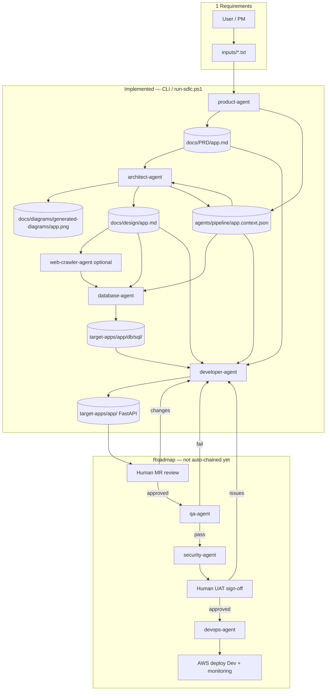

# Flow Chart — SDLC Agentic AI Platform

This document describes the **target** end-to-end delivery pipeline and what is **implemented today** in this repo. A plain-text requirements brief goes in; the long-term goal is a deployed application on AWS with governance and quality gates. Today, the **manual CLI chain** (and `scripts/run-sdlc.ps1`) reliably covers product → architecture → database → developer; QA, security, human approvals, and DevOps deploy are **roadmap**.

Each specialist agent is a **Strands Agent** on Amazon Bedrock with MCP tools. Agents do not share one monolithic prompt—they pass work through **canonical files** plus a small **pipeline context JSON** (`agents/pipeline/<target-app>.context.json`).

---

## Handoff model (context implementation)

| Layer | Role |
|-------|------|
| **Files (source of truth)** | `docs/PRD/<app>.md`, `docs/design/<app>.md`, `docs/diagrams/generated-diagrams/<app>.png`, `target-apps/<app>/db/sql/`, FastAPI code under `target-apps/<app>/` |
| **Pipeline JSON (pointers)** | `targetApp`, `prdPath`, `designDocPath`, `diagramPaths`, `productAgentOutput`, `architectSummary`, optional `dbOutputDir` / `preferredSqlPath` |
| **Discovery** | Architect, database, and developer agents **auto-load** `agents/pipeline/<target-app>.context.json` when `--target-app` is set (unless `--no-auto-context`) |
| **Explicit handoff** | `--context-file agents/pipeline/<app>.context.json` (recommended on PowerShell instead of `--context-json`) |
| **Enrichment** | `agents/_shared/pipeline_context.py` fills missing paths (per-app design doc, PRD on disk, diagram paths, summary from design §1) |

**Per-feature design docs:** `docs/design/<target-app>.md` (not a single shared `design.md`), so parallel features (e.g. FinOps vs RAG) do not overwrite each other.

**Design doc sections (downstream contract):**

| Agent | Reads | Implements |
|-------|--------|------------|
| database-agent | `designDocPath` §3, §6 | SQL under `target-apps/<app>/db/sql/` |
| developer-agent | `designDocPath` §4, §5 | FastAPI routes, auth/audit rules |

The architecture **PNG** is referenced by path in context; agents rely on **design.md tables**, not image bytes.

---

## Flow diagram



---

## Step-by-step flow

### 1. Requirements input

- **Input:** Plain-text brief — `inputs/<feature-slug>.txt` or any path via `--input-file`
- **Who:** User / PM
- **Purpose:** Raw business need (no fixed schema)

### 2. Product-agent ✅

- **Input:** Requirements file
- **Output:**
  - PRD → `docs/PRD/<prd-name>.md` (`--prd-name` slug, e.g. `rag-pdf-system`)
  - Pipeline context → `agents/pipeline/<prd-name>.context.json` (written automatically on PRD save)
  - Jira (optional) → epic + stories via Atlassian MCP (`--project`, `--allow-writes`, `--create-jira-tickets`)
- **Purpose:** Structured product documentation and optional backlog

### 3. Architect-agent ✅

- **Input:** PRD + context (`prdPath`, `productAgentOutput`, `targetApp`)
- **Output:**
  - Diagram → `docs/diagrams/generated-diagrams/<app>.png` (AWS Diagram MCP)
  - Solution design → `docs/design/<app>.md` (design-writer sub-step)
  - Context updated with `designDocPath`, `diagramPaths`, `architectSummary` (via `run-sdlc.ps1` or manual JSON edit)
- **Purpose:** Technical approach, stack, APIs, and data boundaries before build
- **Flags:** `--diagram-name`, `--context-file`, `--skip-design` (diagram only)

### 3b. Web-crawler-agent (optional)

- **When:** `run-sdlc.ps1 -WithWebCrawler` after architect, before database
- **Input:** URLs in context or requirements; design/PRD paths
- **Output:** Scraped markdown under `docs/PRD/scraped/<app>/`, optional Postgres rows (Firecrawl + Postgres MCP)
- **Purpose:** Enrich PRD/design with external docs (not on every run)

### 4. Database-agent 🔄 in progress

- **Input:** `designDocPath` (§3, §6), `prdPath`, `targetApp`, optional diagram paths in context
- **Output:** Migrations and seeds → `target-apps/<app>/db/sql/` (and related `db/` layout)
- **Purpose:** Data model and SQL handoff; optional apply/verify with `--with-postgres` or `--with-mongodb`
- **Flags:** `--target-app`, `--context-file`, `--no-auto-context`, default task if `--task` omitted

### 5. Developer-agent ✅ wired (validation ongoing)

- **Input:** `designDocPath` (§4, §5), PRD, SQL paths when present in context
- **Output:** FastAPI service under `target-apps/<app>/` (scaffold from `_template` if needed); tests under `target-apps/<app>/tests/`
- **Purpose:** Implement application from approved design and schema
- **Note:** GitLab MR creation is agent capability/roadmap—not guaranteed on every CLI run
- **Flags:** `--target-app`, `--context-file`, `--jira-key`

### 6–11. Roadmap (target operating model)

| Step | Status | Notes |
|------|--------|--------|
| Human MR review | Planned | Loop back to developer-agent on changes |
| QA-agent | Planned | Tests + coverage on MR/repo |
| Security-agent | Planned | SAST, dependencies, compliance |
| Human UAT | Planned | Sign-off before release |
| DevOps-agent | Planned | CI/CD + Terraform via GitLab MCP |
| AWS deploy | Planned | Dev environment, CloudWatch, RBAC/secrets/audit |

**Orchestration:** BullMQ TypeScript orchestrator and per-agent `--serve-a2a` exist (`a2a/agent-registry.json`); they do **not** yet replace the manual CLI chain for showcase runs.

---

## How to run the implemented chain

**One script (repo root):**

```powershell
.\scripts\run-sdlc.ps1 -Feature rag-pdf-system -InputFile inputs\rag-pdf-system.txt
```

**Or step-by-step:**

```powershell
# 1 Product
python agents/product-agent/product_agent.py `
  --input-file inputs/rag-pdf-system.txt `
  --prd-name rag-pdf-system

# 2 Architect
python agents/architect-agent/architect_agent.py `
  --target-app rag-pdf-system `
  --diagram-name rag-pdf-system `
  --context-file agents/pipeline/rag-pdf-system.context.json

# 3 Database
python agents/database-agent/database_agent.py `
  --target-app rag-pdf-system `
  --context-file agents/pipeline/rag-pdf-system.context.json

# 4 Developer
python agents/developer-agent/developer_agent.py `
  --target-app rag-pdf-system `
  --context-file agents/pipeline/rag-pdf-system.context.json
```

After product-agent, you may still add a short `productAgentOutput` string to the context JSON for better LLM handoff; paths are pre-seeded automatically.

---

## Progress summary (as of current repo)

| Area | Status |
|------|--------|
| Repo layout, MCP catalog, A2A registry, Cursor skills/rules | ✅ |
| Pipeline context JSON + `pipeline_context.py` enrichment | ✅ |
| Per-feature `docs/design/<app>.md` | ✅ |
| product-agent → PRD + context JSON | ✅ |
| architect-agent → PNG + design | ✅ |
| database-agent → SQL generation; RDS/MCP apply | 🔄 in progress |
| developer-agent → FastAPI in `target-apps/` | ✅ wired; end-to-end validation ongoing |
| web-crawler-agent | ✅ optional branch |
| qa-agent, security-agent, devops-agent, auto orchestration | 📋 roadmap |
| Human gates + AWS deploy | 📋 target model |

**Current validation approach:** Run agents **one at a time** from the CLI with a FinOps or RAG brief; inspect PRD, `agents/pipeline/<app>.context.json`, design doc, diagram, and `db/sql/` before advancing.

---

## Related docs

- `agents/pipeline/README.md` — flags and context template
- `docs/design/README.md` — design doc sections and consumers
- `README.md` — agent roster and folder map
- `CODING_STANDARDS.md` — engineering contract (Cursor reviews / polish)
